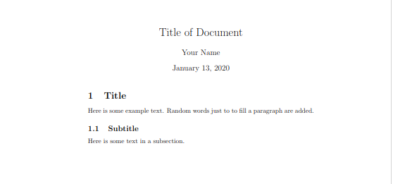

# LaTeX - How to

## Basic structure

Every document starts with a ```\documentclass{}```, that tells the compiler what
kind of document, we want to create. The type goes into the curly braces.

Before the curly braces you can set options that apply to your document. The font
size for example. I usually put the ```a4paper``` option, as that is what my printer
uses.

```latex
% fist line of the document, regular font size is 12pt on a a4paper
% we are writing an article
\documentclass[12pt,a4paper]{article}
```

This is a very typical header. Notice that lines that start with ```%``` are comments
and will be ignored by the compiler. This is a way for you to add commentary to
your code, comment out lines with errors and for me to explain things in the examples.

Also note that these options in the quare brackets are no necessity. So I will not
use them for now.

Common document types are:

| Type     | Description |
|:---------|:------------|
| article  | For articles in scientific journals, presentations, short reports, program documentation, invitations. |
| IEEEtran | For articles with the IEEE Transactions format.|
| proc     | A class for proceedings based on the article class.|
| report   | For longer reports containing several chapters, small books, thesis, ...|
| book     | For real books.|
| slides   | For slides. The class uses big sans serif letters.|
| memoir   | For changing sensibly the output of the document. It is based on the book class, but you can create any kind of document with it [1]|
| letter   | For writing letters.|
| beamer   | For writing presentations (see LaTeX/Presentations).|

Common options are:

| option | Description |
|:-------|:------------|
| 10pt, 11pt, 12pt | Sets the size of the main font in the document. If no option is specified, 10pt is assumed. |
|a4paper, letterpaper,... | Defines the paper size. The default size is letterpaper; However, many European distributions of TeX now come pre-set for A4, not Letter, and this is also true of all distributions of pdfLaTeX. Besides that, a5paper, b5paper, executivepaper, and legalpaper can be specified. |
| fleqn | Typesets displayed formulas left-aligned instead of centered.|
| leqno | Places the numbering of formulas on the left hand side instead of the right. |
| titlepage, notitlepage | Specifies whether a new page should be started after the document title or not. The article class does not start a new page by default, while report and book do.|
| twocolumn | Instructs LaTeX to typeset the document in two columns instead of one.|
| twoside, oneside | Specifies whether double or single sided output should be generated. The classes article and report are single sided and the book class is double sided by default. Note that this option concerns the style of the document only. The option twoside does not tell the printer you use that it should actually make a two-sided printout.|
| landscape | Changes the layout of the document to print in landscape mode.|
| openright, openany | Makes chapters begin either only on right hand pages or on the next page available. This does not work with the article class, as it does not know about chapters. The report class by default starts chapters on the next page available and the book class starts them on right hand pages. |
| draft | makes LaTeX indicate hyphenation and justification problems with a small square in the right-hand margin of the problem line so they can be located quickly by a human. It also suppresses the inclusion of images and shows only a frame where they would normally occur. |

The next necessary step ist to tell LaTeX where our document starts and where it
ends. We do that by using the ```\begin{}``` macro and put ```document``` in the
curly braces. We can't begin a document without ending it aswell. So we put
```\end{document}``` below the ```\begin{document}```.
LaTeX now knows, where the document starts and ends. This is basically the most
minimal document you can write. Although it has no content yet.
So we can just write some words in between ```begin``` and ```end``` and compile
it for the first time.

```latex
\documentclass{article}

\begin{document}
Here is some example text.
\end{document}
```

This is what our doucument looks like so far.

## Compiling

To compile the document we need to have some form of LaTeX installed. If you
install a LaTeX editor it will come with that. There are different products
available, but they all work alike. You type your document, hit the compile button
and the IDE will take care of everything.

To understand what is going on in the background, we are going to compile manually.
Save your LaTeX code with the ```.tex``` file extension.

Then you simply run

```sh
pdflatex /path/to/doument.tex
```

The programm will have compiled your document to a pdf file with the same name.
Not that there are a bunch of more files with different extensions in the directory.
Those are files the compiler needs when compiling. There no longer needed after it's
finnished. It is save to delete them.

## Title

On of the first things you usually want to do in a document is to give it a title.
The ```\maktitle``` macro will display the title, author name and date.

In order for this to work, you need to set ```\title{}``` and ```\author{}```.
The date will be automatically set to todays date. You can change it by adding
the desired date into ```\date{}```. If don't want one of the three values in
your title, you can leave the curly braces blank.

So with the title our document now looks like this:

```latex
\documentclass{article}

\title{Title of Document}
\author{Your Name}

\begin{document}

\maketitle

Here is some example text.
\end{document}
```

## Headings

To structure your contnent with headings and subheadings, you can call ```\section{}```.
The Title of your section (heading) goes in the curly braces. If you want to subdivide
your sections you can call ```\subsection{}```. The sections and subsections, are
numbered automatically by LaTeX.

```latex
\documentclass{article}

\title{Title of Document}
\author{Your Name}

\begin{document}

\maketitle

\section{Title}
Here is some example text. Random words just to to fill a paragraph are added.

\subsection{Subtitle}
Here is some text in a subsection.

\subsubsection{Subsubtitle}
Here is some text in a subsubsection.
\end{document}
```

The output looks like this:



## Table of Contents

If you want to have an index of all your sections and subsections you can use the ```\tableofcontents```
macro. This is going to look like this:


## Index

To create an Index of keywords, and what page to find them on, you can use the ```makeidx```-package. You will have to include the ```\makeindex``` macro in the preamble. Each mention of the Keyword you would like to index, you can annotate using the ```\indedx{keyword}``` macro.

To actually show the index, use ```\printindex```.

```latex
\documentclass{article}
\usepackage{makeidx}

\makeindex

\title{Title of Document}
\author{Your Name}

\begin{document}

\maketitle

Here is some text metioning the keyword.\index{keyword}

\printindex

\end{document}
```


## Lists

## Tables and Figures

```latex
\begin{table}            % will create the float environment
\centering               % centers table
\begin{tabular}{|l|c|r|} % tell LaTeX number of columns and their alignment
\hline                   % horizontal line
Heading 1 & Heading & Heading 3 \\ % columns separated by &, end of row with \\
\hline
1 & 2 & 3 \\
\hline
\end{tabular}
\end{table}
```

## References
